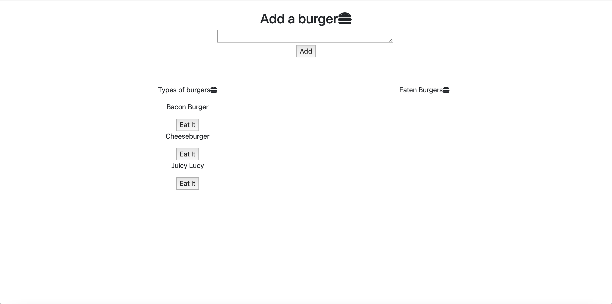
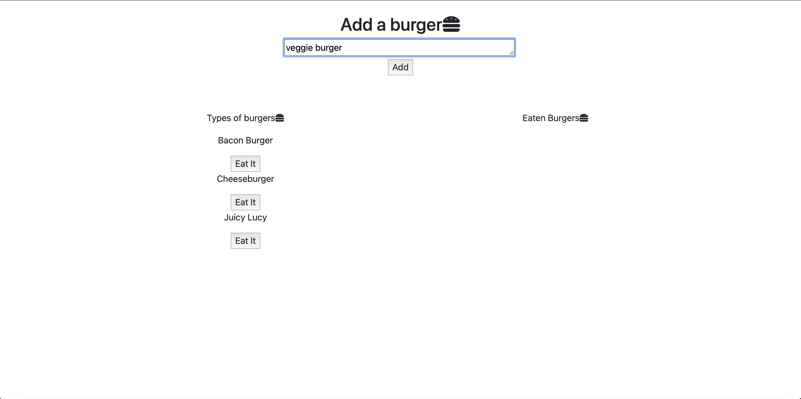
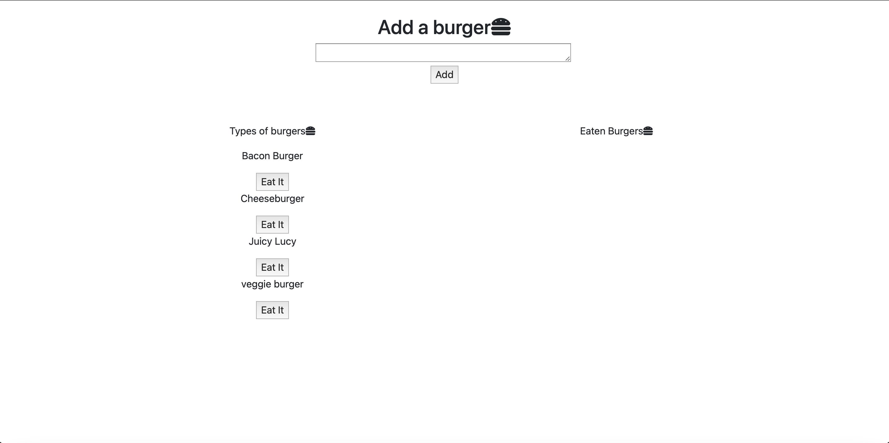
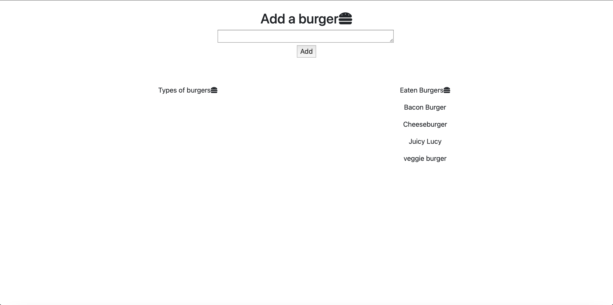

# node-express-handlebars

# Description of project
We were tasked with creating a web app that allows you to add burgers to a database and "eat" them. Once eaten the burger would have it's devoured boolean state to be changed and it would move to a new column on the screen. We used express handlebars to also generate the main html page that could be dynamically updated.

# Links
Repo Link:
https://github.com/slimeforest/node-express-handlebars

Youtube Video Demonstration:
https://www.youtube.com/watch?v=u8Mx_NCXesY

# Screenshots

